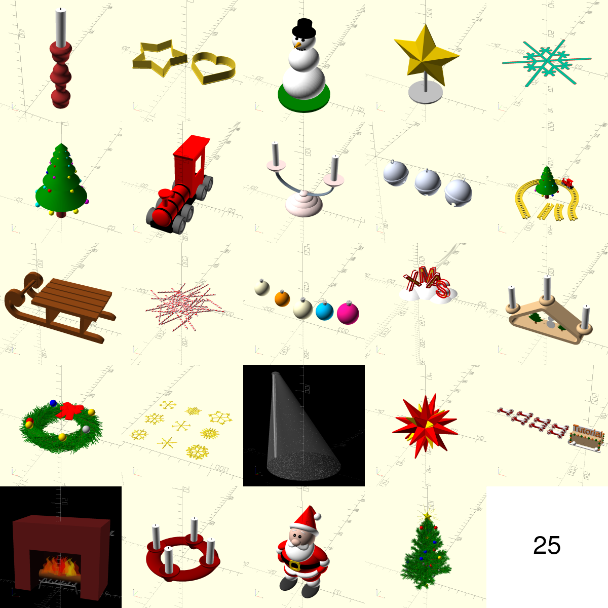

# openscad-advent-calendar-2019



- [x] `Su 1. candleholder1`
- [x] `Mo 2. cookie-cutter`
- [x] `Tu 3. snowman`
- [x] `We 4. star1`
- [x] `Th 5. snowflake2d`
- [x] `Fr 6. tree`
- [x] `Sa 7. train`
- [x] `Su 8. candleholder2`
- [x] `Mo 9. jingle-bells`
- [x] `Tu 10. train-tracks`
- [x] `We 11. sled`
- [x] `Th 12. candystripe`
- [x] `Fr 13. christmas-bulbs`
- [x] `Sa 14. xmas`
- [x] `Su 15. candleholder3`
- [x] `Mo 16. wreath`
- [x] `Tu 17. snowflake3d`
- [ ] `We 18. ?`
- [x] `Th 19. star2`
- [ ] `Fr 20. ?`
- [ ] `Sa 21. ?`
- [x] `Su 22. candleholder4`
- [x] `Mo 23. santa`
- [x] `Tu 24. detailed-tree`
```

* Must work with OpenSCAD 2019.05 (e.g. not snapshot version)
* Should be relatively small and self contained
* Designs need to be CC0
* Idea is to put them later up as HowTo
